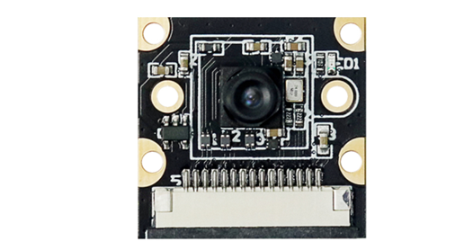
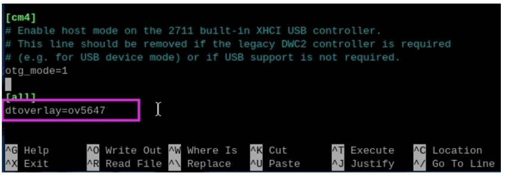

##############################################################################
Get Started
##############################################################################

Note (Important)
***********************************

Please note that our FNK0056 prodcut, which comes with the camera model OV5647, is only compatible with Raspberry Pi; while the product FNK0056B, with camera model IMX219, can work with both Raspberry Pi and Jetson Nano. 

This tutorial introduces the use of product FNK0056(B) on Raspberry Pi.

.. table::
    :align: center
    :class: table-line
    
    +-------------+--------------+------------------------+-----------------------+
    | Product SKU | Camera Model | Work with Raspberry Pi | Wrok with Jetson Nano |
    +=============+==============+========================+=======================+
    | FNK0056     | OV5647       | Yes(this tutorial)     | No                    |
    +-------------+--------------+------------------------+-----------------------+
    | FNK0056B    | IMX219       | Yes(this tutorial)     | Yes                   |
    +-------------+--------------+------------------------+-----------------------+

Step 1 What you will need
*************************************

**Raspberry Pi computer with a Camera Module port**

All current models of Raspberry Pi have a port for connecting the Camera Module.

**A Raspberry Pi Camera Module (Included in this kit)**

.. table::
    :align: center
    :class: table-line
    
    +----------------------------------+-----------------------------------+
    | **FNK0056 OV5647 Camera Module** | **FNK0056B IMX219 Camera Module** |
    +----------------------------------+-----------------------------------+
    | |start17|                        | |start18|                         |
    +----------------------------------+-----------------------------------+

A Camera cable (Included in this kit)

.. table::
    :align: center
    :class: table-line
    
    +------------------------------------------------------------------+
    | **Ribbon cable (15cm) for RaspberryPi 4B/3B+/3B/3A+/2B/1B+/1A+** |
    |                                                                  |
    | |start19|                                                        |
    +------------------------------------------------------------------+
    | **Ribbon cable (15cm) for Raspberry Pi 5 /Zero 2 W/Zero W/Zero** |
    |                                                                  |
    | |start20|                                                        |
    +------------------------------------------------------------------+

Step 2 Assembly and Wiring
************************************************

Wiring
================================================

Camera Side
------------------------------------------------

1.	Gently pull down the plastic clip. 

.. table::
    :align: center
    :class: table-line
    
    +-----------+-----------+
    | |start21| | |start22| |
    +-----------+-----------+

2.	Insert the cable and press back the click.

.. table::
    :align: center
    :class: table-line
    
    +-----------------------------------------------+-----------+-----------+
    |                                               | OV5647    | IMX219    |
    +===============================================+===========+===========+
    | with Raspberry Pi 4B /3B+/3B/3A+/2B/1B+/1A+   | |start23| | |start24| |
    +-----------------------------------------------+-----------+-----------+
    | with Raspberry Pi 5/Zero 2 W/Zero W/Zero      | |start25| | |start26| |
    +-----------------------------------------------+-----------+-----------+

.. |start25| image:: ../_static/imgs/Get_Started/start25.png
.. |start26| image:: ../_static/imgs/Get_Started/start26.png

Raspberry Pi Side
--------------------------------------------------

**Ensure your Raspberry Pi is turned off.**

1. Locate the Camera Module port.

2. Gently pull up on the edges of the port's plastic clip.

3. Insert the Camera Module ribbon cable; make sure the connectors at the bottom of the ribbon cable are facing the contacts in the port.

4. Push the plastic clip back into place.

.. table::
    :align: center
    :class: table-line
    
    +----------------------------------------------------------+
    | Physical pictures with Raspberry Pi 4 and 5 as examples. |
    +----------------------------------------------------------+
    | Raspberry Pi 4                                           |
    |                                                          |
    | |start31|                                                |
    +----------------------------------------------------------+
    | Raspberry Pi 5                                           |
    |                                                          |
    | |start32|                                                |
    +----------------------------------------------------------+

Assemble the camera support
------------------------------------------------

Step 3 How to control the Camera Module via the command line
*******************************************************************

To have the camera be detected successfully, you need to modify the configuration file to add the designated camera driver. 

Take the ov5647 camera as an example. 

1.	Open the config.txt file.

.. code-block:: console
    
    sudo nano /boot/firmware/config.txt

2.	Disable the automatic camera detection function.

.. code-block:: text
    
    camera_auto_detect=0

3.	Add the following instruction at the very bottom.

If you are **not a Raspberry PI 5**, add the following command.

.. code-block:: text
    
    dtoverlay=ov5647

If you are a **Raspberry PI 5**, add the following command.

.. code-block:: text
    
    dtoverlay=ov5647,cam0

:red:`Note:`

   1. :red:`If your camera is imx219, please change ov5647 to imx219.`

   2. :red:`If you actually connect the camera to cam1 instead of cam0, change cam0 to cam1.`

Save the file and exit.

Reboot your raspberry pi.

.. code-block:: console
    
    sudo reboot

Before testing the camera, run the following command to see if the camera can be detected.

.. code-block:: console
    
    ls /dev/video*

/dev/video0 indicates the camera is connected. If you do not find this device, please check the camera wiring. You may reconnect it and try again.

If the camera cannot be detected with the above two commands, please check the camera wiring. You may try reconnecting it to ensure good contact. 

Always ensure that your Raspberry Pi is not powered before operating the camera wiring to avoid burning them.

.. code-block:: console
    
    rpicam-hello

You should see a camera preview window for about five seconds. If you do not, please refer to the Raspberry Pi camera documentation.

You can also enter the following command to capture an image with a resolution of 800 by 600. The image is saved in the current directory path by default.

.. code-block:: console
    
    rpicam-jpeg -o test.jpg -t 2000 --width 800 --height 600

If you have any concerns, please contact us via email: support@freenove.com

Step 4 How to control the Camera Module with Python code
********************************************************************

The Python picamera library allows you to control your Camera Module and create amazing projects.

Open a Python 3 editor, such as **Thonny Python IDE**:

Open a new file and save it as camera.py.

Note: it's important that you never save the file as picamera2.py.

Enter the following code:

.. literalinclude:: ../../../freenove_Kit/Raspberry_Pi/camera.py
    :linenos:
    :language: python
    :lines: 1-10
    :dedent:

Or you can Open Terminal,

1. Download tutorial and code with the command:

.. code-block:: console

    git clone https://github.com/Freenove/Freenove_Camera_Module_for_Raspberry_Pi

2. Enter Raspberry_Pi folder with cd command.

.. code-block:: console

    cd ~/Freenove_Camera_Module_for_Raspberry_Pi/Raspberry_Pi

3. Run the code

.. code-block:: console

    python camera.py

The following script will:

1. Open the camera system

2. Generate a camera configuration suitable for preview

3. Configure the camera system with that preview configuration

4. Start the preview window

5. Start the camera running

6. Wait for two seconds and capture a JPEG file (still in the preview resolution)

In addition, you can set Preview window parameters,

The preview implementation takes exactly the same parameters:

- x - the x-offset of the preview window

- y - the y-offset of the preview window

- width - the width of the preview window

- height - the height of the preview window

- transform - a transform that allows the camera image to be horizontally and/or vertically flipped on the display

All the parameters are optional, and default values will be chosen if omitted. The following example will place an

800x600 pixel preview window at (100, 200) on the display, and will horizontally mirror the camera preview image:

Open Terminal,

1. Enter Raspberry_Pi folder with cd command.

.. code-block:: console

    cd ~/Freenove_Camera_Module_for_Raspberry_Pi/Raspberry_Pi

2. Run the code

.. code-block:: console

    python camera_transform.py

Enter the following code:

.. literalinclude:: ../../../freenove_Kit/Raspberry_Pi/camera_transform.py
    :linenos:
    :language: python
    :lines: 1-6
    :dedent:

The supported transforms are:

- Transform() - the identity transform, which is the default

- Transform(hflip=1) - horizontal flip

- Transform(vflip=1) - vertical flip

- Transform(hflip=1, vflip=1) - horizontal and vertical flip (equivalent to a 180 degree rotation)

It's important to realise that the display transform discussed here does not have any effect on the actual images received from the camera. It only applies the requested transform as it renders the pixels onto the screen. We’ll encounter camera transforms again when it comes actually to transforming the images as the camera delivers them. Please also note that in the example above, the start_preview() function must be called before the call to picam2.start() . Finally, if the camera images have a different aspect ratio to the preview window, they will be letter- or pillar-boxed to fit, preserving the image’s proper aspect ratio.

**Next use the camera to capture videos:**

In Picamera2, the process of capturing and encoding video is largely automatic. The application only has to define what encoder it wants to use to compress the image data, and how it wants to output this compressed data stream.

The mechanics of taking the camera images that arrive, forwarding them to an encoder, which in turn sends the results directly to the requested output, is entirely transparent to the user. The encoding and output all happens in a separate thread from the camera handling to minimise the risk of dropping camera frames.

Here is a first example of capturing a ten-second video.

Open Terminal,

1. Enter Raspberry_Pi folder with cd command.

.. code-block:: console

    cd ~/Freenove_Camera_Module_for_Raspberry_Pi/Raspberry_Pi

2. Run the code

.. code-block:: console

    python camera_h264.py

Enter the following code:

.. literalinclude:: ../../../freenove_Kit/Raspberry_Pi/camera_h264.py
    :linenos:
    :language: python
    :lines: 1-11
    :dedent:

In this example we use the H.264 encoder. For the output object we can just use a string for convenience; this will be interpreted as a simple output file. For configuring the camera, the create_video_configuration is a good starting point, as it will use a larger buffer_count to reduce the risk of dropping frames.

We also used the convenient start_recording and stop_recording functions, which start and stop both the encoder and the camera together. Sometimes it can be useful to separate these two operations, for example you might want to start and stop a recording multiple times while leaving the camera running throughout. 

For this reason, start_recording could have been replaced by:

.. code-block:: python
    :linenos:

    encoder.output = 'test.h264'
    picam2.start_encoder(encoder)
    picam2.start()

and stop_recording by:

.. code-block:: python
    :linenos:

    picam2.stop()
    picam2.stop_encoder()

All the video encoders can be constructed with parameters that determine the quality (amount of compression) of the output, such as the bitrate for the H.264 encoder. For those not so familiar with the details of these encoders, these parameters can also be omitted in favour of supplying a quality to the start_encoder or start_recording functions. 

Thepermitted quality parameters are: 

- **Quality.VERY_LOW**

- **Quality.LOW**

- **Quality.MEDIUM - this is the default for both functions if the parameter is not specified**

- **Quality.HIGH**

- **Quality.VERY_HIGH**

This quality parameter only has any effect if the encoder was not passed explicit codec-specific parameters. It could be used like this: 

Open Terminal,

1. Enter Raspberry_Pi folder with cd command.

.. code-block:: console

    cd ~/Freenove_Camera_Module_for_Raspberry_Pi/Raspberry_Pi

2. Run the code

.. code-block:: console

    python camera_quality.py

Enter the following code:

.. literalinclude:: ../../../freenove_Kit/Raspberry_Pi/camera_quality.py
    :linenos:
    :language: python
    :lines: 1-22
    :dedent:

You can also check out the official documentation to learn more about picamera2:

https://datasheets.raspberrypi.com/camera/picamera2-manual.pdf

There are so many interesting examples for you to learn in picamera2.

The official library link is as follows:

https://github.com/raspberrypi/picamera2