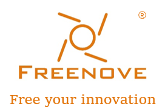

##############################################################################
Welcome
##############################################################################

Thank you for choosing Freenove products!

Get Started
***************************************

Please follow this tutorial to set up the camera.

Get Support
***************************************

Encounter problems? Don't worry! Refer to “TroubleShooting.pdf” or contact us.

When there are packaging damage, quality problems, questions encountering in use, etc., just send us an email. We will reply to you within one working day and provide a solution.

support@freenove.com

About
***************************************

Freenove provides open source electronic products and services.

Freenove is committed to helping customers learn programming and electronic knowledge, quickly implement product prototypes, realize their creativity and launch innovative products. Our services include:

- Kits for learning programming and electronics

- Kits compatible with Arduino®, Raspberry Pi®, micro:bit®, etc.

- Kits for robots, smart cars, drones, etc.

- Components, modules and tools

- Design and customization

To learn more about us or get our latest information, please visit our website:

http://www.freenove.com

Copyright
************************************

All the files provided in the ZIP file are released under Creative Commons Attribution-NonCommercial-ShareAlike 3.0 Unported License. You can find a copy of the license in the ZIP file.

It means you can use these files on your own derived works, in part or completely. But not for commercial use.

Freenove® brand and logo are trademarks of Freenove Creative Technology Co., Ltd. Must not be used without permission.

Other registered trademarks and their owners appearing in this document:

Arduino® is a trademark of Arduino LLC (https://www.arduino.cc/).

Raspberry Pi® is a trademark of Raspberry Pi Foundation (https://www.raspberrypi.org/).

Micro:bit® is a trademark of Micro:bit Educational Foundation (`<https://www.microbit.org/>`_).